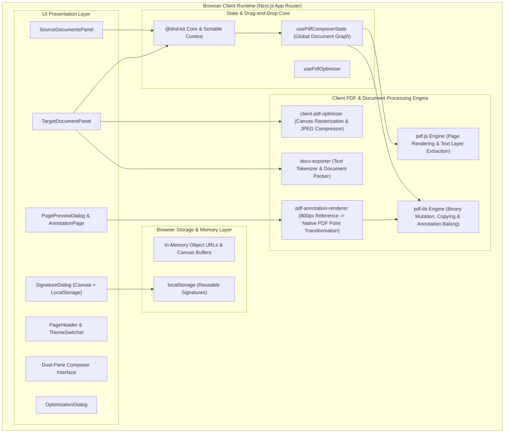
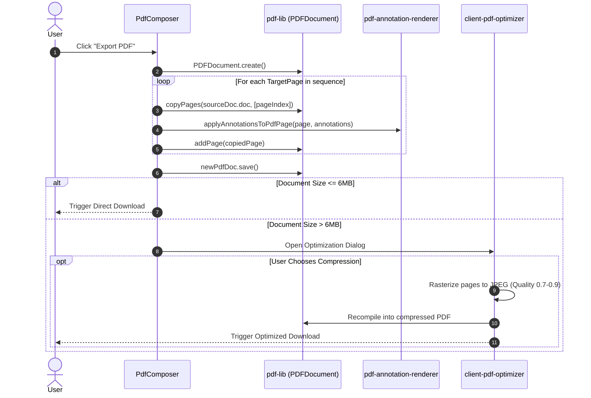

# Technical Design Document: SuperFast PDF Composer

**Author:** DeepMind / Antigravity Engineering  
**Project:** SuperFast PDF Composer  
**Document Status:** Approved / Production Specification  
**Last Updated:** October 2026  
**Target Repository:** [`c:/Dev/superfastPDFComposer`](file:///c:/Dev/superfastPDFComposer)

---

## 1. Executive Summary

**SuperFast PDF Composer** is a client-first, high-performance web application engineered for visual PDF assembly, manipulation, annotation, and export. Operating exclusively within the client's browser runtime, the system eliminates cloud data processing and guarantees absolute data privacy (Zero Data Leakage).

Users can upload multiple multi-page PDFs and images, visually organize pages across a dual-pane workspace with drag-and-drop mechanics, inspect and annotate individual pages with vector graphics, text, and digital signatures, and compile optimized final documents as PDF or Word (.docx) files.

---

## 2. Architecture Principles & Scope

### 2.1. Core Architectural Pillars
1. **100% Client-Side Processing (Zero Data Leakage):** No document binary or extracted metadata is sent to any external server during composition, rendering, annotation, optimization, or download.
2. **Deterministic Document Fidelity:** Exact page dimensions, orientations, and aspect ratios from original source documents are maintained during compilation.
3. **Smooth Interactive Assembly:** Drag-and-drop interactions, reordering, and canvas annotations run at 60 FPS using hardware-accelerated transforms and lightweight thumbnail caching.
4. **Memory-Aware Operations:** Large documents with hundreds of pages are managed through streaming canvas renders and explicit memory cleanup (`page.cleanup()`, blob revoking).

### 2.2. Goals & Non-Goals
* **Goals:**
  * Support mixed-media intake (PDF, JPG, PNG) with automatic image-to-PDF standardizing.
  * Side-by-side source and target document canvas.
  * Freeform page reordering, duplication, rotation, and deletion.
  * In-browser high-res page preview with vector annotations and digital signature pad.
  * Dynamic vector-to-PDF coordinate space mapping.
  * On-demand client-side JPEG compression pipeline for oversized outputs (>6MB).
  * Text extraction and Word (`.docx`) file compilation.
* **Non-Goals:**
  * Complex OCR on scanned raster PDFs (targeted for future phase).
  * Server-side PDF storage and collaborative multi-user editing.
  * Full preservation of complex layouts, vector graphics, and CSS styling in Word exports.

---

## 3. High-Level Architecture Diagram



---

## 4. Technology Stack & Dependencies

| Layer | Technology | Purpose |
| :--- | :--- | :--- |
| **Framework** | Next.js 16.x (App Router), React 19.x | Application shell, client-side rendering boundaries, layout management |
| **Language** | TypeScript 5.x | Strict type safety across document structures, annotations, and event payloads |
| **UI Design System** | Tailwind CSS 3.4, ShadCN UI (Radix Primitives) | Accessible UI components, responsive dual-pane layout, glassmorphic themes |
| **Drag & Drop** | `@dnd-kit/core`, `@dnd-kit/sortable`, `@dnd-kit/utilities` | Accessible, pointer-sensor drag-and-drop between source and target grids |
| **PDF Manipulation** | `pdf-lib` (v1.17.1) | Direct byte-level PDF creation, page extraction, copying, rotation, and vector drawing |
| **PDF Rendering** | `pdfjs-dist` (v4.4.168) | In-browser canvas rasterization for thumbnails, full-screen previews, and text extraction |
| **Word Export** | `docx` (v8.5.0), `file-saver` | Word document packing and browser download trigger |
| **Icons & Visuals** | `lucide-react` | Unified SVG icon suite |

---

## 5. Domain Models & Type System

The system domain models are defined in [`src/lib/types.ts`](file:///c:/Dev/superfastPDFComposer/src/lib/types.ts):

### 5.1. Target & Source Data Entities
```typescript
export type TargetPage = {
  id: string;                 // Unique identifier for dnd-kit collision resolution
  docId: string;              // Foreign key to SourceDoc.id
  originalPageIndex: number;  // 0-indexed page number in the source PDF
  annotations?: Annotation[]; // Array of visual annotations overlaid on this page
};

export type SourceDoc = {
  id: string;                                   // Unique document UUID
  doc: PDFDocument;                             // Loaded pdf-lib document instance
  pdfjsDoc: PDFDocumentProxy;                   // Loaded pdf.js proxy instance for rendering
  file: File;                                   // Original browser File reference
  filename: string;                             // Display name
  thumbnailUrls: (string | undefined | null)[]; // Cached base64/data URLs for page cards
};
```

### 5.2. Annotation Entities
```typescript
export type Annotation = 
  | TextAnnotation 
  | DrawingAnnotation 
  | IconAnnotation 
  | SignatureAnnotation;

export type TextAnnotation = {
  id: string;
  type: 'text';
  x: number;
  y: number;
  width: number;
  height: number;
  text: string;
  fontSize: number;
  fontColor: string;
  isEditing: boolean;
};

export type DrawingAnnotation = {
  id: string;
  type: 'drawing';
  paths: { x: number; y: number }[][];
  strokeColor: string;
  strokeWidth: number;
};

export type IconAnnotation = {
  id: string;
  type: 'icon';
  iconType: 'check' | 'cross';
  x: number;
  y: number;
  size: number;
  strokeColor: string;
  strokeWidth: number;
};

export type SignatureAnnotation = {
  id: string;
  type: 'signature';
  x: number;
  y: number;
  width: number;
  height: number;
  dataUrl: string; // Encoded PNG/JPG data URI
};
```

---

## 6. Detailed Subsystems & Component Workflows

### 6.1. Multi-Format Ingestion Pipeline
1. **File Selection & Drop Reception:** Users drag and drop or select files via the input file elements in [`SourceDocumentsPanel`](file:///c:/Dev/superfastPDFComposer/src/components/composer/source-documents-panel.tsx).
2. **Format Branching:**
   - **PDF Files (`application/pdf`):**
     1. Read byte stream via `file.arrayBuffer()`.
     2. Instantiate `pdf-lib.PDFDocument.load(arrayBuffer)` for byte operations.
     3. Instantiate `pdfjs.getDocument({ data: arrayBuffer })` for canvas rendering.
     4. Generate thumbnail asynchronously for each page and stream into `thumbnailUrls` state.
   - **Image Files (`image/jpeg`, `image/png`):**
     1. Create a blank PDF document with standard A4 dimensions (`PageSizes.A4`).
     2. Embed image using `embedJpg()` or `embedPng()`.
     3. Calculate aspect-preserving scale factor: `scale = Math.min(pageWidth / imgWidth, pageHeight / imgHeight)`.
     4. Center image within the A4 boundary: `x = (pageW - scaledW) / 2`, `y = (pageH - scaledH) / 2`.
     5. Save synthesized PDF into byte buffer and load into `SourceDoc` registry.

### 6.2. Composition & Drag-and-Drop Engine
Implemented in [`use-pdf-composer-state.ts`](file:///c:/Dev/superfastPDFComposer/src/hooks/use-pdf-composer-state.ts) and [`pdf-composer.tsx`](file:///c:/Dev/superfastPDFComposer/src/components/pdf-composer.tsx):
- **Collision Detection:** Configured using `closestCenter` with a `PointerSensor` activation threshold of `8px` distance to prevent accidental drags during clicks.
- **Inter-Pane Dragging:** When dragging from `SourceDocumentsPanel` (`from: "source"`) to `TargetDocumentPanel` (`over.id === "target-droppable-area"` or hovering an existing item), a new `TargetPage` object is created with a unique composite ID (`target-${docId}-${pageIndex}-${timestamp}`) and inserted at the targeted index.
- **Intra-Pane Sorting:** When dragging within the target pane (`from: "target"`), `arrayMove(targetPages, oldIndex, newIndex)` updates the visual sequence instantly.

### 6.3. Annotation & Coordinate Transformation Engine
A primary challenge in web-based PDF editing is translating screen-space coordinates into native PDF point dimensions.

#### Coordinate Space Mapping System
* **Reference Screen Coordinate System:** The web preview container [`AnnotationPage`](file:///c:/Dev/superfastPDFComposer/src/components/annotation-page.tsx) uses a standardized reference width of `800px` with a top-left origin `(0, 0)`.
* **Native PDF Coordinate System:** Standard PDF points (72 points/inch) have origin `(0, 0)` at the **bottom-left** of the page.
* **Transformation Equations:**
  $$\text{Scale Ratio } S = \frac{\text{PageWidth}_{\text{PDF}}}{\text{BaseWidth} (800)}$$
  $$X_{\text{PDF}} = X_{\text{Screen}} \times S$$
  $$Y_{\text{PDF}} = \text{PageHeight}_{\text{PDF}} - (Y_{\text{Screen}} \times S) - \text{ElementHeight}_{\text{PDF}}$$

#### Baking Annotations into PDF
Handled by [`applyAnnotationsToPdfPage`](file:///c:/Dev/superfastPDFComposer/src/lib/pdf-annotation-renderer.ts):
- **Text:** Embedded using standard Helvetica font (`pdfDoc.embedFont(StandardFonts.Helvetica)`), rendering native selectable text with exact RGB color values.
- **Vector Icons:** Checkmarks and crosses are rendered directly using native PDF vector lines (`page.drawLine()`) for sharp resolution at any zoom.
- **Freehand Drawings:** Converted from mouse stroke arrays into SVG path strings (`M x y L x y ...`) and baked using `page.drawSvgPath()`.
- **Signatures:** Embedded as PNG/JPG raster layers into `pdf-lib` and drawn at precise transformed bounding boxes.

### 6.4. PDF Compilation & Export Pipeline


### 6.5. Client-Side Optimization Pipeline
Managed by [`client-pdf-optimizer.service.ts`](file:///c:/Dev/superfastPDFComposer/src/services/client-pdf-optimizer.service.ts):
1. Accepts raw PDF File and configurable settings (`maxWidth`, `quality`, `onProgress`).
2. Iterates over pages via `pdfjsDoc.getPage(i)`.
3. Scales viewport according to `maxWidth` constraints.
4. Renders viewport to off-screen HTML5 `<canvas>`.
5. Exports compressed JPEG binary using `canvas.toDataURL('image/jpeg', quality)`.
6. Embeds JPEGs into a fresh `PDFDocument` instance and invokes `context.clearRect()` and `page.cleanup()` after every page to prevent browser tab crashes from memory leakage.

### 6.6. Word (.docx) Extraction Pipeline
Handled by [`docx-exporter.service.ts`](file:///c:/Dev/superfastPDFComposer/src/services/docx-exporter.service.ts):
1. Reads all `targetPages` sequentially.
2. Extracts raw textual tokens from `pdfjsDoc.getPage(i).getTextContent()`.
3. Normalizes tokens into `docx.Paragraph` nodes.
4. Inserts `pageBreakBefore: true` between distinct PDF pages.
5. Bundles paragraphs into a single section and triggers `Packer.toBlob(doc)` for direct local `.docx` download.

---

## 7. Security, Privacy & Performance

### 7.1. Zero-Knowledge & Zero-Egress Privacy Model
- **No Cloud Document Storage:** All binary decoding, drawing, manipulation, and encoding occur strictly within V8 / WebAssembly client threads.
- **Air-Gap Capability:** Once initial static assets (JS, CSS, WASM/Worker bundles) are loaded into browser cache, the application can operate entirely without an active internet connection.

### 7.2. Memory & Performance Guardrails
- **Worker Isolation:** `pdfjs.GlobalWorkerOptions.workerSrc` utilizes dedicated web worker threads (`pdf.worker.min.mjs`) for non-blocking rendering.
- **Resource Deallocation:** Page canvases in the preview and optimization modules explicitly invoke `.cleanup()` and clear context after rendering passes.
- **Micro-Animations & Layout:** Background dynamic blobs use CSS hardware acceleration (`backdrop-blur`, CSS keyframes) with `mix-blend-mode` to minimize reflow overhead.

---

## 8. Directory & Code Organization

```
c:/Dev/superfastPDFComposer/
├── docs/
│   ├── blueprint.md                     # High-level product blueprint & requirements
│   └── technical-design-document.md     # Comprehensive technical design (this document)
├── public/                              # Static icons, favicons, and manifest assets
├── src/
│   ├── app/                             # Next.js App Router root layout & main page
│   │   ├── globals.css                  # Global styles, Tailwind directives & animations
│   │   ├── layout.tsx                   # Root HTML shell & font providers
│   │   └── page.tsx                     # Application entry point & modal container
│   ├── components/
│   │   ├── composer/                    # Core composer panels
│   │   │   ├── draggable-source-page.tsx
│   │   │   ├── page-thumbnail.tsx
│   │   │   ├── sortable-target-page.tsx
│   │   │   ├── source-documents-panel.tsx
│   │   │   └── target-document-panel.tsx
│   │   ├── ui/                          # ShadCN accessible UI component primitives
│   │   ├── annotation-page.tsx          # Full-screen interactive annotation canvas
│   │   ├── annotation-toolbar.tsx       # Tool selection (Text, Icons, Draw, Signature)
│   │   ├── page-preview-dialog.tsx      # High-res inspection & 90-degree rotation modal
│   │   ├── pdf-composer.tsx             # Master orchestrator component
│   │   ├── signature-dialog.tsx         # HTML5 Canvas signature pad & storage manager
│   │   └── optimization-dialog.tsx      # Compression modal & progress tracker
│   ├── hooks/
│   │   ├── use-pdf-composer-state.ts    # Centralized document graph & DND handlers
│   │   ├── use-pdf-optimizer.ts         # Compression state & lifecycle hook
│   │   └── use-toast.ts                 # Notification system
│   ├── lib/
│   │   ├── pdf-annotation-renderer.ts   # Screen -> PDF point coordinate translation & baking
│   │   ├── types.ts                     # Domain interfaces & TypeScript type declarations
│   │   └── utils.ts                     # Class merge (clsx + tailwind-merge)
│   └── services/
│       ├── client-pdf-optimizer.service.ts # Canvas rasterization & compression engine
│       └── docx-exporter.service.ts     # PDF.js text layer extraction to Word exporter
├── package.json                         # Dependencies & project scripts
└── tailwind.config.ts                   # Tailwind theming, animations & color palette
```

---

## 9. Error Handling & Edge Cases

| Scenario | Risk | Mitigation Strategy |
| :--- | :--- | :--- |
| **Corrupt / Password-Protected PDF** | Application crash during `PDFDocument.load` | Wrapped in `try/catch` with destructive Toast notification informing user of invalid format or encryption. |
| **Unsupported Image Format (TIFF, HEIC)** | Failed image parsing | Explicit MIME check in `processImageFile()` restricting to `image/jpeg` and `image/png` with user error toast. |
| **Browser Out of Memory (OOM)** | Large PDF compilation crash | Incremental page processing, offscreen canvas cleanup, and optional rasterization compression threshold. |
| **Missing Worker Bundle** | PDF.js fails to initialize | Dynamic fallback check on `window` and explicit `workerSrc` assignment to local bundled `pdf.worker.min.mjs`. |
| **Missing Source Document on Export** | Null pointer exception if source doc was removed | `targetPage` check verifies `sourceDocs[targetPage.docId]`; missing pages are skipped with console warning. |

---

## 10. Future Roadmap & Extensibility

1. **Client-Side OCR Integration:** Integrate Tesseract.js / WebAssembly OCR for extracting text from scanned image PDFs prior to Word export.
2. **Form Field Fill & Flattening:** Support interactive AcroForm fields filling and flattening via `pdf-lib` Form API.
3. **Encrypted Cloud Sync:** Optional end-to-end encrypted backup/sync via Firebase / WebCrypto API where the server never possesses the decryption key.
4. **AI Summary & Q&A:** Native in-browser Google Genkit integration (scaffolded in `src/ai/`) for generating document abstracts and key takeaway bullet points.
